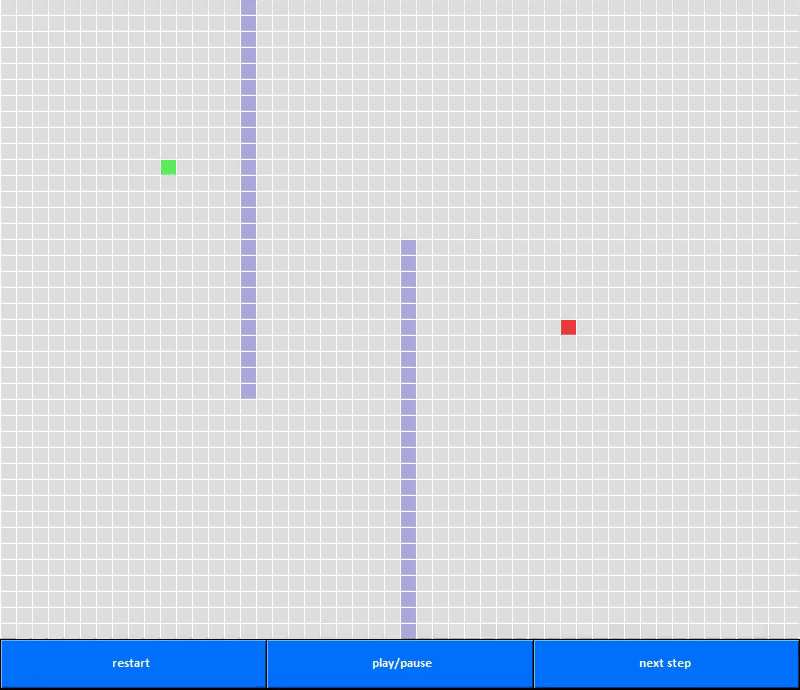

# Pathfinding adventure

Just a small personnal project I recently started to experiment and have fun with pathfinding algorithms.

I'm planning on implementing A* and creating a small GUI to better display how it works and interract with it.
First step is implementing BFS and displaying it, then clean the code and prepare for more advanced manipulations and A*.

Here's BFS at work for the first step :

Going well so far.
